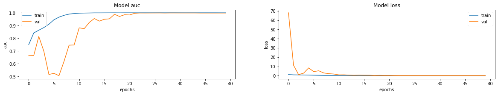

# 👋 Hello

## Note - Refer to the link to get the pretrained model : https://drive.google.com/file/d/1ZhhG5ZEaqaLGQH5ZpZ5RxLakUDOp-DZ3/view?usp=sharing

# Resultant Curve of the model - 
## (Left to Right) Accuracy and Loss of the model - 

## (Left to Right) Precision and Recall - 

# Early Alzheimer Disease Detection with MRI Scan

Alzheimer's disease is an irreversible, progressive brain disorder that slowly destroys memory and thinking skills and, eventually, the ability to carry out the simplest tasks. In most people with the disease—those with the late-onset type—symptoms first appear in their mid-60

## Stages of Alzheimer's Disease

Alzheimer's disease tends to develop slowly and gradually worsens over several years. Eventually, Alzheimer's disease affects most areas of your brain. Memory, thinking, judgment, language, problem-solving, personality and movement can all be affected by the disease.

There are four stages associated with Alzheimer's Disease -

1. **Mild Dementia (Severe Dementia)**

In late stage severe dementia due to Alzheimer's disease, people generally:

* Lose the ability to communicate coherently. An individual can no longer converse or speak in ways that make sense, although he or she may occasionally say words or phrases.

* Require daily assistance with personal care. This includes total assistance with eating, dressing, using the bathroom and all other daily self-care tasks.

* Experience a decline in physical abilities. A person may become unable to walk without assistance, then unable to sit or hold up his or her head without support. Muscles may become rigid and reflexes abnormal. Eventually, a person loses the ability to swallow and to control bladder and bowel functions.

2. **Moderate Dementia**

People with the moderate dementia stage of Alzheimer's disease may:

* Show increasingly poor judgment and deepening confusion. Individuals lose track of where they are, the day of the week or the season. They may confuse family members or close friends with one another or mistake strangers for family.

They may wander, possibly in search of surroundings that feel more familiar. These difficulties make it unsafe to leave those in the moderate dementia stage on their own.

* Experience even greater memory loss. People may forget details of their personal history, such as their address or phone number, or where they attended school. They repeat favorite stories or make up stories to fill gaps in memory.

* Need help with some daily activities. Assistance may be required with choosing proper clothing for the occasion or the weather and with bathing, grooming, using the bathroom and other self-care. Some individuals occasionally lose control of their bladder or bowel movements.

* Undergo significant changes in personality and behavior. It's not unusual for people with the moderate dementia stage to develop unfounded suspicions — for example, to become convinced that friends, family or professional caregivers are stealing from them or that a spouse is having an affair. Others may see or hear things that aren't really there.

Individuals often grow restless or agitated, especially late in the day. Some people may have outbursts of aggressive physical behavior.

3. **Non - Dementia**

In the mild dementia stage, people may experience:

* Memory loss of recent events. Individuals may have an especially hard time remembering newly learned information and ask the same question over and over.

* Difficulty with problem-solving, complex tasks and sound judgments. Planning a family event or balancing a checkbook may become overwhelming. Many people experience lapses in judgment, such as when making financial decisions.

* Changes in personality. People may become subdued or withdrawn — especially in socially challenging situations — or show uncharacteristic irritability or anger. Reduced motivation to complete tasks also is common.

* Difficulty organizing and expressing thoughts. Finding the right words to describe objects or clearly express ideas becomes increasingly challenging.

* Getting lost or misplacing belongings. Individuals have increasing trouble finding their way around, even in familiar places. It's also common to lose or misplace things, including valuable items.

4. **Very Mild Dementia**

Alzheimer's disease begins long before any symptoms become apparent. This stage is called preclinical Alzheimer's disease, and it's usually identified only in research settings. You won't notice symptoms during this stage, nor will those around you.

This stage of Alzheimer's can last for years, possibly even decades. Although you won't notice any changes, new imaging technologies can now identify deposits of a protein called amyloid-beta that is a hallmark of Alzheimer's disease. The ability to identify these early deposits may be especially important for clinical trials and in the future as new treatments are developed for Alzheimer's disease.

Additional biomarkers — measures that can indicate an increased risk of disease — have been identified for Alzheimer's disease. These biomarkers can be used to support the diagnosis of Alzheimer's disease, typically after symptoms appear.

Genetic tests also can tell you if you have a higher risk of Alzheimer's disease, particularly early-onset Alzheimer's disease. These tests aren't recommended for everyone, but you and your doctor can discuss whether genetic testing might be beneficial for you.
